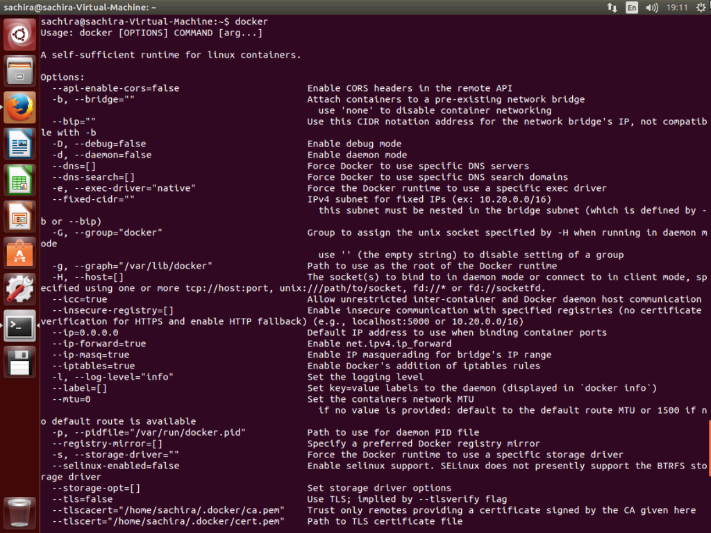
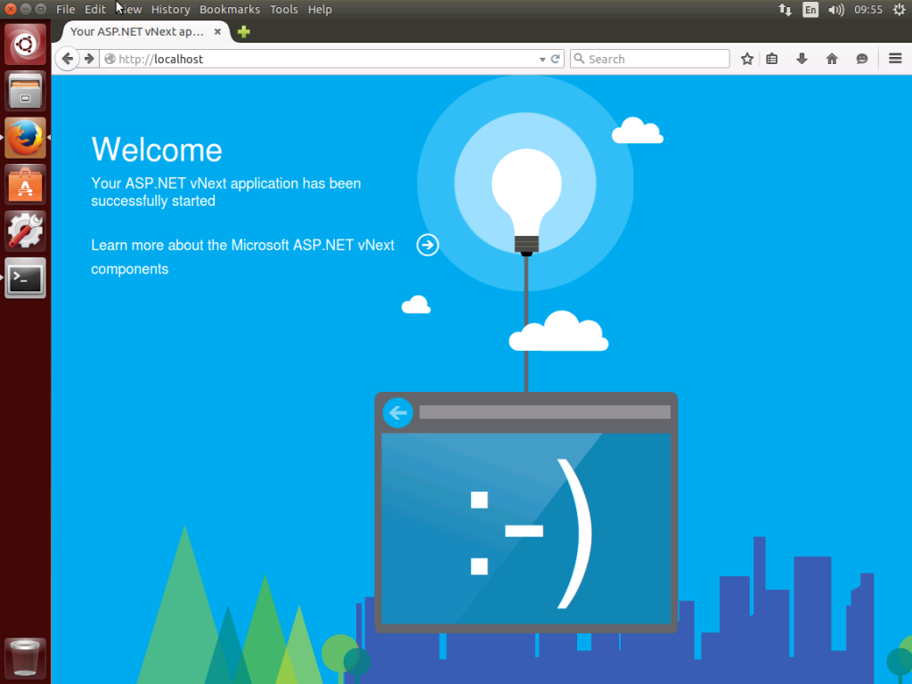

While surfing MSDN blogs today early morning, I saw this blog post about [hosting ASP.Net application in Linux virtual machine in Azure](https://devblogs.microsoft.com/aspnet/running-asp-net-5-applications-in-linux-containers-with-docker/). After I read this great blog post, first thing came to my mind was why don’t I install Linux locally on a VM and try the same scenario. In this blog post I’ll describe step by step installation and configuration of Ubuntu, Docker and run ASP.Net application in it.

Download [Ubuntu iso image](https://web.archive.org/web/20150729011659/http://www.ubuntu.com/download/desktop/install-ubuntu-desktop). Using this image you can create Ubuntu VM either using VMware Player/ Workstation or Hyper-V. In my case I used Hyper-V. It doesn’t matter what hypervisor you use, only woking Ubuntu VM/ machine needed.

You can update your VM to latest version if needed after the installation, since I like to use latest updates, I installed all updates to my VM.

## Install Docker on Ubuntu

You can read full article about intalling Docker on Ubuntu from [this](https://web.archive.org/web/20150728052852/https://docs.docker.com/installation/ubuntulinux/) link. I extracted the necessary information from it and stated it below.

1. Check whether APT can work with https URLs, if not install apt-transport-https.

```bash
[ -e /usr/lib/apt/methods/https ] || {
  apt-get update
  apt-get install apt-transport-https
}
```

2. Add Docker repository to your local keychain

```bash
$ sudo apt-key adv --keyserver hkp://keyserver.ubuntu.com:80 --recv-keys 36A1D7869245C8950F966E92D8576A8BA88D21E9
```

3. Update your repository and install Docker

```bash
$ sudo sh -c "echo deb https://get.docker.com/ubuntu docker main\
> /etc/apt/sources.list.d/docker.list"
$ sudo apt-get update
$ sudo apt-get install lxc-docker
```

Please go through [this](https://web.archive.org/web/20150728052852/https://docs.docker.com/installation/ubuntulinux/) tutorial for get more information about installing Docker in Linux.

After finish installing Docker, when you run docker you should get output as below screen.



## Prepare Docker container

1. I’m going to use vNext ASP.Net project at GitHub.

```bash
$ git clone https://github.com/aspnet/Home.git aspnet-home
$ cd aspnet-home/samples/HelloWeb
```

2. Create `Dockerfile` and add content specified here.

```bash
$ sudo apt-get install emacs
$ touch Dockerfile
$ emacs Dockerfile
```

```docker
FROM microsoft/aspnet

COPY . /app
WORKDIR /app
RUN ["kpm", "restore"]

EXPOSE 5004
ENTRYPOINT ["k", "kestrel"]
```

From above code it does following things.

- `FROM microsoft/aspnet` Get the [base image](https://web.archive.org/web/20150728052852/http://registry.hub.docker.com/u/microsoft/aspnet/) for ASP.Net from Microsoft
- `COPY . /app`  Copy content of current folder (HelloWeb) to /app directory of the container
- `WORKDIR /app` This sets current working directory to /app folder
- `RUN ["kpm", "restore"]` Download all the dependencies of the application
- `EXPOSE 5004` Informs Docker that the container will listen on the specified ports at runtime. Docker uses this information to interconnect containers using links and to determine which ports to expose to the host.
- `ENTRYPOINT ["k", "kestrel"]` `ENTRYPOINT` command is used to keep the container as executable. In this case, it’ll start kestrel server which will host ASP.Net site.

## Build and run container image

1. Run Docker build command to build the image

```bash
$ sudo docker build -t myapp .
```

2. Check available Docker images

```bash
$ docker images
```

3. Run Docker container

```bash
$ sudo docker run -t -d -p 80:5004 myapp
```

- `-t` switch attaches a pseudo-tty to the container (this switch will not be necessary in future versions of ASP.NET 5).
- `-d` switch runs container in background.
- `-p` switch maps local 80 port to 5004 port in container.
- `myapp` is the Docker image we are going to use

4. See currently running containers

```bash
$ sudo docker ps
```

5. Goto http://localhost from browser



Now you have a ASP.Net vNext site running on Linux with Docker. 😊

Try it out and let me know what happen. Happy coding!! 😊
