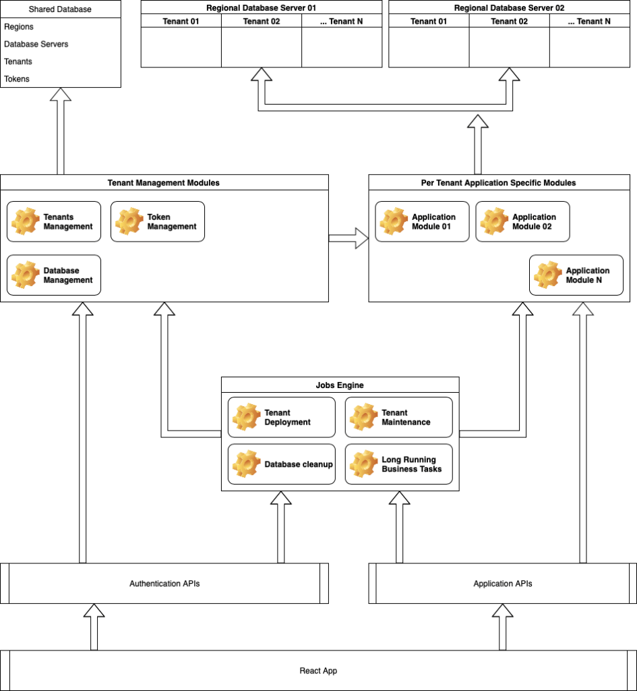
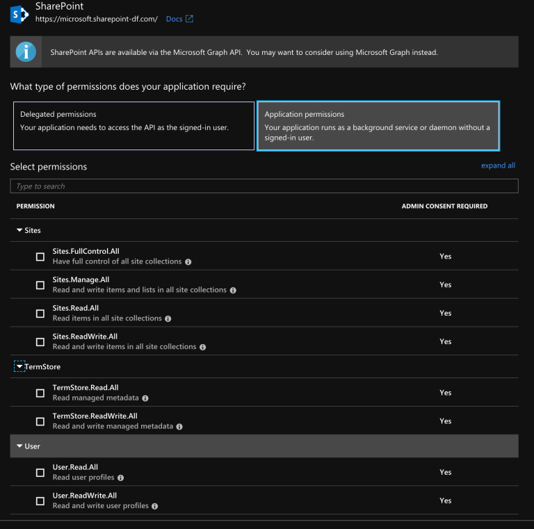
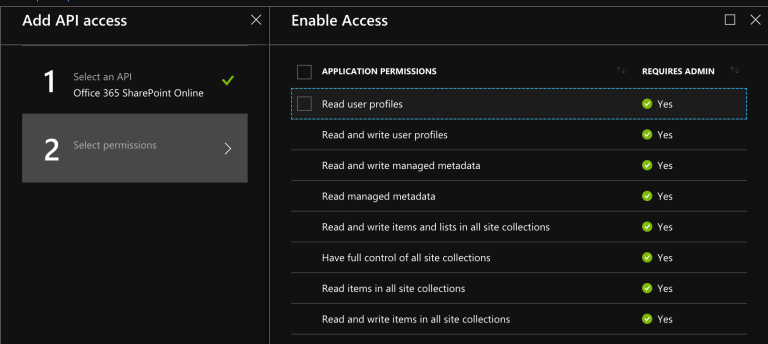
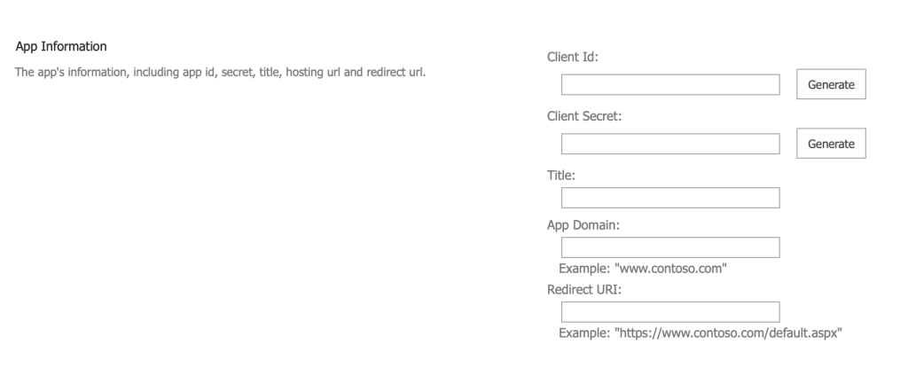
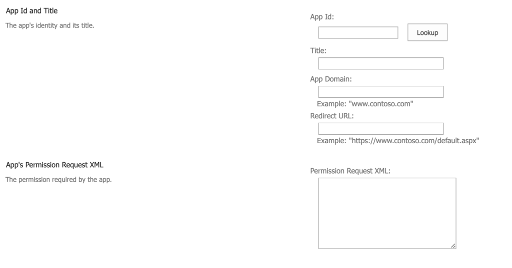
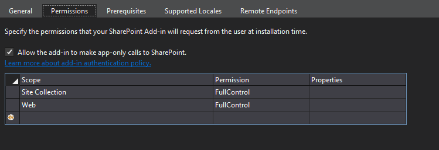

Reason I thought to write this blog is due to all hardships I met while working on recent project which needed high-trust for SharePoint site collection. This project was a migration from exiting SharePoint server side app to WebAPI+ReactJS app. Requirement from client was quite simple, he wanted

- Application to function as it is on new platform with no major UI changes
- Application should be purchasable from SharePoint App Store
- Final product must be fully scalable and must have ability to work on different regions according to user preferance

After reviewing the existing application, we gathered following technical aspects of the application which we thought significant enough to the way - application should be developed.

- Application deploys fields and content types to site collection it deployed which later consumed by sub sites of that site collection (15+ fields, 8+ content types)
- Above mentioned content types has template documents which contain fields from the content type
- Application creates groups on site collection on its deployment which later used to validate users whom can access the application
- Application creates and customize new sub-sites under the site collection
- Application creates new roles and groups on new sub-sites which used in different lists and libraries in the sub-site
- Application has ability to search users by querying

As you may understood from above points, some of these tasks can be time consuming which cannot be completed within reasonable time frame for a web request. Most importantly, these tasks cannot be done without full-trust to the site collection.

First problem we decided to address was the fact that this app needs high-trust for the site collection. In order to get this done, we had two paths to choose, use ACS or use AAD multi-tenant app. After discussing these alternatives with client, we decided to go full-blown AAD app as authentication layer. We had few reasons to choose this path,

- Microsoft announced that ACS will be retired, but they clearly mentioned that ACS work without any issue for SP apps. Even though they said that, we thought it’s better to use new and advanced technology rather than rely or outdated and “will be retired soon” technology.
- We knew that if we go ACS, we will need separate high-trust app which needs to be installed on tenant manually. Also we knew that, after the first installation, tenant admin has to update the client secret for the app with-in correct time frames. Both us and client agreed that, if we can prevent this, it’d be better since this require certain level of knowledge on scripting and this can leads to difficulties for end user.

## Application architecture: putting big boy pants on



Since this is a multi-tenant application, we have two types of databases in the system, one to keep all tenants details and others are per-tenant databases created on different regions. These regions and database servers can be managed from shared database, this same shared database is responsible to store user tokens and user session details. Tenant database name, user and password are generated by runtime and stored encrypted in shared database. Same goes to access tokens stored in the database. Simply put, all sensitive data stored in the shared database are stored encrypted, 2 different keys used to encrypt tenant data and shared data (database server details).

Here’s thoughts on each module in the diagram.

- Shared database – Contains shared data of all tenants. Most entities in this database are cached by data access layer to reduce the workload on database itself. Sensitive data are encrypted.
- Tenant database(s) – These databases are deployed by job engine, each database contains only business specific tables which used by application. In order to access one of these databases, application must get connection details from shared database, then access these databases accordingly. Each tenant can have only one database in the system.
- Tenant management modules – This is the data access layer for shared database. As I mentioned previously, entities like Region, Database Server, Tenant and Token are wrapped by caching module. Each entity have different cache expire time which can be configured.
- Per tenant application specific modules – This is the data access layer and business logic for tenant data. These repositories cannot be instantiated without an associated tenant. With tenant provided, modules in this layer can access tenant database and perform business logic related tasks.
- Jobs engine – This is the engine used to execute long running tasks. This part of engine needs high-trust token to run its tasks. It doesn’t rely on user tokens. Here are some tasks performed by this engine,
  - Tenant deployment – After user completes application installation steps, this module creates the tenant database and then make necessary changes to the app site collection. Site collection changes includes, creating fields and content types, create pages and create necessary user groups.
  - Tenant maintenance – When there’re changes to tenant database schema after the first deployment, this module can be used to deploy those to existing tenant databases. This module also can be used to add changes to site collection and sub sites if needed. We can control whether given tenant needs to be upgraded or not by using field in Tenant table.
  - Tenant specific tasks – This module performs long running business specific tasks. Difference between this and above two modules is that, scope of this module is restricted to one tenant.
  - Database cleanup – Clean expired access tokens and session details from the database. This is the only triggered job in the application. This jobs triggers ones a day and cleans old data.
- Application APIs – API used to access business data. Token based authentication enabled. Uses secure, HTTP only cookie to authentication.
- Authentication APIs – This API is responsible to creating access tokens and schedule tenant deployment and maintenance tasks.
- React app – Front end application

## Azure Active Directory: Good intentions – bad execution

So we started completely relying on AAD as authentication layer for the app. We first finished simple data access layer for the API and then started integrating it with AAD. Since this is a multi-tenant app, AAD app we created was also a multi-tenant app which required SharePoint related capabilities. Now if you just try to look For SharePoint related permissions in AAD app selection section, you won’t be able to find it. In order for you to see SharePoint permissions there, you must have an attached SharePoint tenant for that AAD. Yeh, it is dumb requirement (in my opinion at least) and makes no sense, specially when we create a multi-tenant application. But it is what it is, if you ever met a point where you can’t get app permissions for SharePoint, you have two options,

1. Forget about AAD you intended to create the app, go to one of SharePoint tenants you have, go to it’s Office Admin Centre, then you can find Azure Active Directory connected to that tenant. If you create this app inside that AAD, you will be able to see permissions related to SharePoint.
2. Assign new SharePoint tenant to the AAD you are using. In order to do that, you have to follow few steps.
   - First create an internal admin user in your AAD if there aren’t any. Reason I mentioned this is, sometimes we use external users as an admin for the AAD and attaching new SharePoint tenant to AAD doesn’t work properly when you are using an external user.
   - Log in to the AAD using internal user.
   - Goto Azure Active Directory -> Enterprise Applications
   - Make sure you don’t have “Office 365 SharePoint Online” on your application list, if you have it, you may have different issue causing not to get SharePoint permissions.
   - Select “Add an application” and search for SharePoint.
   - Select “Office 365 SharePoint Online”, there you can see URL which can use to create new tenant.
   - Make sure you are logged in from internal admin user for your AAD and create new SharePoint tenant after selecting your pricing tier.
   - Follow steps to configure your SharePoint tenant and after that voila!! You have a SharePoint tenant connected to your AAD
Now if you are thinking, “whhooo, hard part is done, easy part next”, I have to break your heart my friend, because worst part is yet to come, and trust me, you won’t like it when you see it

Now we are proceeding to create new AAD app which is going to utilize SharePoint permissions set. You can use either “Application registrations” or “Application registrations (Preview)”, which currently show same permission sets in different layouts. We set redirect URL for the app and make application multi-tenant. Next is setting up SharePoint permissions. Under “SharePoint” (Preview) / “Office 365 SharePoint Online” you can find the permissions available for the app.

|                            Application registration (Preview) SharePoint permissions                             |                            Application registration Office 365 SharePoint Online permissions                             |
| :--------------------------------------------------------------------------------------------------------------: | :----------------------------------------------------------------------------------------------------------------------: |
|  |  |

Now if you look closely at this, you may notice something very concerning, “Sites.FullControl.All” in preview and “Read and write items and lists in all site collections”, first thing came to my mind was, wait a second now, does it say “all site collections”? It indeed does. But for application we develop, we only need permissions to one site collection, the site collection which app is installed. There’s no use for app to ask full permissions for all site collections, and asking full permissions for ALL site collections is lot to ask. Even a very reasonable admin would just deny to give full permissions to all site collections for an external application.

This actually waved big red flag in my mind saying “this will not work”, but developer inside me assured that, since Microsoft is leaving ACS behind, and they are bringing SharePoint permissions to AAD, we may be able to find way out of it. Also same developer told me that, this would simplify the installation of the app a lot, it does not require installing any other apps, it will just work after the first installation.

So I listened to the developer inside me, and proceed to work with integrating AAD to app. One thing I want to point out here is that, even though we use AAD for app-only permissions, we can’t completely forget ACS and user permissions. As of the time I’ve been working on this project (December 2018), sellardashboard issued client id and secret works only with ACS, and also, licensing model available for SharePoint apps only works with ACS issued client id and secret. I will write different post explaining how I achieved authorizing and maintaining state for both ACS (for user) and AAD (for app) inside application. But after few days of struggling with different kind of tokens and caching and claims, I was able to complete a functioning authentication layer.

After finishing business logics and frontend, it was time to submit the app to the store. As you have undoubtedly guessed, first submission got failed. Reason to submission fail was point 5.9 in [https://docs.microsoft.com/en-us/office/dev/store/validation-policies#bk_5](https://docs.microsoft.com/en-us/office/dev/store/validation-policies#bk_5)

<blockquote class="wp-block-ugb-blockquote ugb-blockquote ugb-blockquote--v2 ugb--background-opacity-5 ugb-blockquote--design-plain"><div class="ugb-content-wrapper"><svg viewBox="0 0 50 50" xmlns="http://www.w3.org/2000/svg" style="fill:;width:70px;height:70px"><path d="M19.8 9.3C10.5 11.8 4.6 17 2.1 24.8c2.3-3.6 5.6-5.4 9.9-5.4 3.3 0 6 1.1 8.3 3.3 2.2 2.2 3.4 5 3.4 8.3 0 3.2-1.1 5.8-3.3 8-2.2 2.2-5.1 3.2-8.7 3.2-3.7 0-6.5-1.2-8.6-3.5C1 36.3 0 33.1 0 29 0 18.3 6.5 11.2 19.6 7.9l.2 1.4zm26.4 0C36.9 11.9 31 17 28.5 24.8c2.2-3.6 5.5-5.4 9.8-5.4 3.2 0 6 1.1 8.3 3.2 2.3 2.2 3.4 4.9 3.4 8.3 0 3.1-1.1 5.8-3.3 7.9-2.2 2.2-5.1 3.3-8.6 3.3-3.7 0-6.6-1.1-8.6-3.4-2.1-2.3-3.1-5.5-3.1-9.7 0-10.7 6.6-17.8 19.7-21.1l.1 1.4z"></path></svg><p class="ugb-blockquote__text" style="color:">
Your app or add-in cannot request unreasonably high permissions or full-control permission.<br><br>SharePoint Add-ins that request full-control permissions are not accepted in AppSource.<br><br>If your app or add-in requires full-control permission, your Store add-ins might be dependent on add-ins that are deployed to a customer’s tenant outside the AppSource process. For more information, see&nbsp;&nbsp;<a href="https://developer.microsoft.com/office/blogs/combining-store-add-ins-with-high-trust-permissions/">Combining AppSource add-ins with high trust permissions now supported</a>.</p></div></blockquote>

Since we knew that it’s unreasonable to ask full permissions to this application, we decided that AAD wasn’t the path to go. Microsoft has clarified that retirement of ACS doesn’t impact SharePoint apps. It doesn’t say they will support it forever, but they haven’t mentioned a date which they would go for a new system as well. As this post says on top [https://docs.microsoft.com/en-au/sharepoint/dev/sp-add-ins/three-authorization-systems-for-sharepoint-add-ins](https://docs.microsoft.com/en-au/sharepoint/dev/sp-add-ins/three-authorization-systems-for-sharepoint-add-ins).

<blockquote class="wp-block-ugb-blockquote ugb-blockquote ugb-blockquote--v2 ugb--background-opacity-5 ugb-blockquote--design-plain"><div class="ugb-content-wrapper"><svg viewBox="0 0 50 50" xmlns="http://www.w3.org/2000/svg" style="fill:;width:70px;height:70px"><path d="M19.8 9.3C10.5 11.8 4.6 17 2.1 24.8c2.3-3.6 5.6-5.4 9.9-5.4 3.3 0 6 1.1 8.3 3.3 2.2 2.2 3.4 5 3.4 8.3 0 3.2-1.1 5.8-3.3 8-2.2 2.2-5.1 3.2-8.7 3.2-3.7 0-6.5-1.2-8.6-3.5C1 36.3 0 33.1 0 29 0 18.3 6.5 11.2 19.6 7.9l.2 1.4zm26.4 0C36.9 11.9 31 17 28.5 24.8c2.2-3.6 5.5-5.4 9.8-5.4 3.2 0 6 1.1 8.3 3.2 2.3 2.2 3.4 4.9 3.4 8.3 0 3.1-1.1 5.8-3.3 7.9-2.2 2.2-5.1 3.3-8.6 3.3-3.7 0-6.6-1.1-8.6-3.4-2.1-2.3-3.1-5.5-3.1-9.7 0-10.7 6.6-17.8 19.7-21.1l.1 1.4z"></path></svg><p class="ugb-blockquote__text" style="color:">Azure Access Control (ACS), a service of Azure Active Directory (Azure AD), will be retired on November 7, 2018. This retirement does not impact the SharePoint Add-in model, which uses the&nbsp;<code>https://accounts.accesscontrol.windows.net</code>&nbsp;hostname (which is not impacted by this retirement). For more information, see&nbsp;<a href="https://dev.office.com/blogs/impact-of-azure-access-control-deprecation-for-sharepoint-add-ins">Impact of Azure Access Control retirement for SharePoint Add-ins</a>.<br></p></div></blockquote>

We did not have any option but to use ACS for the high-trust part of the application.

## Azure Access Control – Nice workaround, didn’t work 😀

Our first submission got rejected mercilessly, and we knew what to do. But in my mind, I still wanted to make installation of high-trust app easy as possible. Keeping that in mind, I started to explore ways to get it done.

First and foremost thing I wanted to do was to generate client id and client secret per tenant. I did not wanted to share one client id and secret for all tenants because these are visible to the person who install the application. Generating client id was easy because it was just a guid. But client secret was bit tricky. Looking at the format of client id generated from /_layouts/15/AppRegNew.aspx, I’ve noticed that the string used in client secret is a Base64 string. Then the question came, which would provide string same length as in that page randomly. Answer was Sha256 hash encoded as Base64. Below is an extract from tenant creation logic which used to generate client id and secret.

```csharp
public override Task<Tenant> Create(Tenant obj)
{
    ....
    var highTrustClientId = Guid.NewGuid().ToString("D");
    var highTrustClientSecret = GetSha256(Guid.NewGuid().ToString("D"));
    obj.HighTrustClientId = highTrustClientId.EncryptClientData();
    obj.HighTrustClientSecret = highTrustClientSecret.EncryptClientData();
    ....
}
public static string GetSha256(string str)
{
    var crypt = new SHA256Managed();
    var crypto = crypt.ComputeHash(Encoding.ASCII.GetBytes(str));
    return Convert.ToBase64String(crypto);
}
```

So, now I have client id and secret per tenant, next was the way to use this in the app. Since this part goes to high-trust app, this client id and secret must be added to the SharePoint manually. To do that, we have a page provided by Microsoft, `/_layouts/15/AppRegNew.aspx`,



we can ask user who installs the application to enter client id and secret generated previously, app domain and redirect url must be added according to the URL we are going to use for high-trust app. So we did that, we added installation screen to the first run of the application, in order to create tenant database, user must first follow steps to add provided client id and secret to SharePoint using this page.

Next step is to add app itself and get required permissions for it. Here comes the workaround I came to use. Since I so desperately wanted reduce the number of steps which needs to be followed by user, instead of installing new high-trust app in the site collection, I thought to just grant permissions to app created above.

There’s a page in SharePoint to update permissions of an app. `/_layouts/15/AppInv.aspx`, using this page we can update existing permissions of an app, but thing also can be done in this page is to grant permissions to an app created in `/_layouts/15/AppRegNew.aspx` page. So I just used just that. I added new next step in same installation page to instruct user to goto this page and enter the client id generated by the system, then lookup for it,



When user click Lookup button, it loads the details of the app created previously, then in next page, we can add the permissions XML we want to use. This documentation [https://docs.microsoft.com/en-us/sharepoint/dev/sp-add-ins/add-in-permissions-in-sharepoint](https://docs.microsoft.com/en-us/sharepoint/dev/sp-add-ins/add-in-permissions-in-sharepoint) gives a good idea about available permissions to use here, if you want to use UI, you can just create new SharePoint app project from Visual Studio and open AppManifest.xml file and set permissions using Permissions tab.



After adding required permissions and allowing app only permissions, you can right click on same file and open it from code editor. Part you need to copy is `<AppPermissionRequests></AppPermissionRequests>` section. In my case, permissions XML I used looked like this,

```xml
<AppPermissionRequests AllowAppOnlyPolicy="true">
    <AppPermissionRequest Scope="http://sharepoint/content/sitecollection" Right="FullControl" />
    <AppPermissionRequest Scope="http://sharepoint/content/sitecollection/web" Right="FullControl" />
</AppPermissionRequests>
```

I instructed user to enter this XML on /_layouts/15/AppRegNew.aspx page, it simply asks user to allow permissions to the app, and voila, we have permissions for our client id and secret. There’re few good outcomes of using this method,

- It does not require installing app from app catalog, site collection admin can install the high-trust app without much trouble
- It does not have another app installed in the site collection to confuse the users, only app installed from the store is seen in the Site Content page, high-trust app is hidden from users, as it should be
- Site collection admin can easily revoke permissions from “App Permissions” page and there won’t be any trace of high-trust app after that.
I personally thought this is a really good way to deploy a high-trust app and this one will get approved without any issue, how wrong I was.

Second app submission got failed with 4.18 of [https://docs.microsoft.com/en-us/office/dev/store/validation-policies#bk_4](https://docs.microsoft.com/en-us/office/dev/store/validation-policies#bk_4),

<blockquote class="wp-block-ugb-blockquote ugb-blockquote ugb-blockquote--v2 ugb--background-opacity-5 ugb-blockquote--design-plain"><div class="ugb-content-wrapper"><svg viewBox="0 0 50 50" xmlns="http://www.w3.org/2000/svg" style="fill:;width:70px;height:70px"><path d="M19.8 9.3C10.5 11.8 4.6 17 2.1 24.8c2.3-3.6 5.6-5.4 9.9-5.4 3.3 0 6 1.1 8.3 3.3 2.2 2.2 3.4 5 3.4 8.3 0 3.2-1.1 5.8-3.3 8-2.2 2.2-5.1 3.2-8.7 3.2-3.7 0-6.5-1.2-8.6-3.5C1 36.3 0 33.1 0 29 0 18.3 6.5 11.2 19.6 7.9l.2 1.4zm26.4 0C36.9 11.9 31 17 28.5 24.8c2.2-3.6 5.5-5.4 9.8-5.4 3.2 0 6 1.1 8.3 3.2 2.3 2.2 3.4 4.9 3.4 8.3 0 3.1-1.1 5.8-3.3 7.9-2.2 2.2-5.1 3.3-8.6 3.3-3.7 0-6.6-1.1-8.6-3.4-2.1-2.3-3.1-5.5-3.1-9.7 0-10.7 6.6-17.8 19.7-21.1l.1 1.4z"></path></svg><p class="ugb-blockquote__text" style="color:">Your add-in may not alter, or promote the alteration of, SharePoint or Office except via the Office and SharePoint Add-ins model.</p></div></blockquote>

They also have added some extra information on the submission test results document,

<blockquote class="wp-block-ugb-blockquote ugb-blockquote ugb-blockquote--v2 ugb--background-opacity-5 ugb-blockquote--design-plain"><div class="ugb-content-wrapper"><svg viewBox="0 0 50 50" xmlns="http://www.w3.org/2000/svg" style="fill:;width:70px;height:70px"><path d="M19.8 9.3C10.5 11.8 4.6 17 2.1 24.8c2.3-3.6 5.6-5.4 9.9-5.4 3.3 0 6 1.1 8.3 3.3 2.2 2.2 3.4 5 3.4 8.3 0 3.2-1.1 5.8-3.3 8-2.2 2.2-5.1 3.2-8.7 3.2-3.7 0-6.5-1.2-8.6-3.5C1 36.3 0 33.1 0 29 0 18.3 6.5 11.2 19.6 7.9l.2 1.4zm26.4 0C36.9 11.9 31 17 28.5 24.8c2.2-3.6 5.5-5.4 9.8-5.4 3.2 0 6 1.1 8.3 3.2 2.3 2.2 3.4 4.9 3.4 8.3 0 3.1-1.1 5.8-3.3 7.9-2.2 2.2-5.1 3.3-8.6 3.3-3.7 0-6.6-1.1-8.6-3.4-2.1-2.3-3.1-5.5-3.1-9.7 0-10.7 6.6-17.8 19.7-21.1l.1 1.4z"></path></svg><p class="ugb-blockquote__text" style="color:">Add-ins published to AppSource are not allowed to inject (or require users to inject) scripts on SharePoint pages to accomplish functionality outside the SharePoint Add-in Model. Your add-in currently requires the injection of a script file on to parent pages. Please use the APIs within the Add-in Model to accomplish similar functionality or create an Add-in Part with said scripts within your Add-in.<br><br>Please see this blog post on Combining AppSource add-ins with high trust permissions for an overview on a possible solution: <a href="http://dev.office.com/blogs/combining-store-add-ins-with-high-trust-permissions">http://dev.office.com/blogs/combining-store-add-ins-with-high-trust-permissions</a></p></div></blockquote>

Here the word we have to worry is “Your add-in currently requires the injection of a script file on to parent pages.”, which means, we can’t use `/_layouts/15/AppRegNew.aspx` page to allow permissions to the app.

With that bombshell, I’ve left with no other solution but to make high-trust app a separate app package which can be uploaded to app catalog and then to be installed in the site collection.

## Azure Access Control – The right way

Only challenge I had here was to create app package on runtime per tenant because we had per-tenant client id and secret. I did not wanted to change this model in any way simply due to security implications of it.

I started with adding new SharePoint add-in project to the solution and added necessary permissions to it as described in previous step. Then generated a package from that project with dummy client id and secret. Since app package is just a zip file with all content in it, I decided to edit this app package on the fly for tenants.

```csharp
[Route("high-trust-app")]
[HttpGet]
public HttpResponseMessage GetHighTrustApp()
{
    using (var appStream = GetResourceFileAsStream("HighTrust.app"))
    {
        using (var tempStream = new MemoryStream())
        {
            appStream.CopyTo(tempStream);
            tempStream.Seek(0, SeekOrigin.Begin);
            using (var archive = new ZipArchive(tempStream, ZipArchiveMode.Update, true))
            {
                var entry = archive.GetEntry("AppManifest.xml");
                var appManifestXmlDocument = new XmlDocument();
                if (entry != null)
                {
                    using (var entryStream = entry.Open())
                    {
                        using (var appManifest = new StreamReader(entryStream))
                        {
                            appManifestXmlDocument.Load(appManifest);
                        }
                    }
                    entry.Delete();
                }
                var newEntry = archive.CreateEntry("AppManifest.xml");
                using (var newEntryStream = newEntry.Open())
                {
                    using (var stringWriter = new StreamWriter(newEntryStream))
                    {
                        using (var xmlTextWriter = XmlWriter.Create(stringWriter))
                        {
                            var clientIdNode = appManifestXmlDocument.DocumentElement?["AppPrincipal"]?["RemoteWebApplication"];
                            if (clientIdNode?.Attributes != null)
                            {
                                clientIdNode.Attributes["ClientId"].Value = CurrentTenantInstance.HighTrustClientId.DecryptClientData();
                            }
                            var startPageNode = appManifestXmlDocument.DocumentElement?["Properties"]?["StartPage"];
                            if (startPageNode != null)
                            {
                                startPageNode.InnerText = $"{high-trust-app-loginl}?{{StandardTokens}}";
                            }
                            appManifestXmlDocument.WriteTo(xmlTextWriter);
                            xmlTextWriter.Flush();
                        }
                    }
                }
            }
            tempStream.Seek(0, SeekOrigin.Begin);
            var httpResponseMessage = Request.CreateResponse(HttpStatusCode.OK);
            var memoryStream = new MemoryStream();
            using (var archive = new ZipArchive(memoryStream, ZipArchiveMode.Create, true))
            {
                var zipEntry = archive.CreateEntry("HighTrust.app");
                using (var entryStream = zipEntry.Open())
                {
                    tempStream.CopyTo(entryStream);
                }
            }
            memoryStream.Seek(0, SeekOrigin.Begin);
            httpResponseMessage.Content = new StreamContent(memoryStream);
            httpResponseMessage.Content.Headers.ContentDisposition = new ContentDispositionHeaderValue("attachment")
            {
                FileName = $"HighTrustApp.zip"
            };
            httpResponseMessage.Content.Headers.ContentType = new MediaTypeHeaderValue("application/octet-stream");
            return httpResponseMessage;
        }
    }
}
```

This simply get the resource file (high-trust app package) embedded in the project and edit that file to contain client id for the logged in tenant and update its login url. This API endpoint returns package in a zip file due to download files with .app extension directly from URL blocks on some browsers.

And app was submitted for the third time……….., and it failed again.

## One last thing

App submission was failed again with 5.9 of [https://docs.microsoft.com/en-us/office/dev/store/validation-policies#bk_5](https://docs.microsoft.com/en-us/office/dev/store/validation-policies#bk_5) but it had different message in the report this time.

<blockquote class="wp-block-ugb-blockquote ugb-blockquote ugb-blockquote--v2 ugb--background-opacity-5 ugb-blockquote--design-plain"><div class="ugb-content-wrapper"><svg viewBox="0 0 50 50" xmlns="http://www.w3.org/2000/svg" style="fill:;width:70px;height:70px"><path d="M19.8 9.3C10.5 11.8 4.6 17 2.1 24.8c2.3-3.6 5.6-5.4 9.9-5.4 3.3 0 6 1.1 8.3 3.3 2.2 2.2 3.4 5 3.4 8.3 0 3.2-1.1 5.8-3.3 8-2.2 2.2-5.1 3.2-8.7 3.2-3.7 0-6.5-1.2-8.6-3.5C1 36.3 0 33.1 0 29 0 18.3 6.5 11.2 19.6 7.9l.2 1.4zm26.4 0C36.9 11.9 31 17 28.5 24.8c2.2-3.6 5.5-5.4 9.8-5.4 3.2 0 6 1.1 8.3 3.2 2.3 2.2 3.4 4.9 3.4 8.3 0 3.1-1.1 5.8-3.3 7.9-2.2 2.2-5.1 3.3-8.6 3.3-3.7 0-6.6-1.1-8.6-3.4-2.1-2.3-3.1-5.5-3.1-9.7 0-10.7 6.6-17.8 19.7-21.1l.1 1.4z"></path></svg><p class="ugb-blockquote__text" style="color:">Your add-in appears to have a dependence on an add-in acquired from outside of the Office Store. You must clearly state this in your add-in description, as submitted via the Seller Dashoard, using the text provided at <a href="http://dev.office.com/blogs/combining-store-add-ins-with-high-trust-permissions">http://dev.office.com/blogs/combining-store-add-ins-with-high-trust-permissions</a><br></p></div></blockquote>

We were confused at first seeing the message simply because of the blog mentioned in the message haven’t directly specified that given text must be in the app description. Our understanding was that, it’s something which added by Microsoft. Clearly what we understood was wrong, after adding this text to app description,

<blockquote class="wp-block-ugb-blockquote ugb-blockquote ugb-blockquote--v2 ugb--background-opacity-5 ugb-blockquote--design-plain"><div class="ugb-content-wrapper"><svg viewBox="0 0 50 50" xmlns="http://www.w3.org/2000/svg" style="fill:;width:70px;height:70px"><path d="M19.8 9.3C10.5 11.8 4.6 17 2.1 24.8c2.3-3.6 5.6-5.4 9.9-5.4 3.3 0 6 1.1 8.3 3.3 2.2 2.2 3.4 5 3.4 8.3 0 3.2-1.1 5.8-3.3 8-2.2 2.2-5.1 3.2-8.7 3.2-3.7 0-6.5-1.2-8.6-3.5C1 36.3 0 33.1 0 29 0 18.3 6.5 11.2 19.6 7.9l.2 1.4zm26.4 0C36.9 11.9 31 17 28.5 24.8c2.2-3.6 5.5-5.4 9.8-5.4 3.2 0 6 1.1 8.3 3.2 2.3 2.2 3.4 4.9 3.4 8.3 0 3.1-1.1 5.8-3.3 7.9-2.2 2.2-5.1 3.3-8.6 3.3-3.7 0-6.6-1.1-8.6-3.4-2.1-2.3-3.1-5.5-3.1-9.7 0-10.7 6.6-17.8 19.7-21.1l.1 1.4z"></path></svg><p class="ugb-blockquote__text" style="color:"><em>This SharePoint add-in works in conjunction with another add-in, which is only available from the provider. This requires installation on your environment outside of the Microsoft Office Store processes due the level of required permissions. A tenant administrator will need to deploy this specific add-in to the tenant manually, so that it can be installed to your environment. When apps are installed outside of the Microsoft Office Store, they may bypass any, and all, safety and security checks provided by Microsoft.</em><br><br><em>If you have not done so already, it is recommended that you establish contact with the provider before proceeding with installation.&nbsp; Consider trying this add-in on a separate SharePoint Tenancy before installing it on your primary SharePoint site(s).</em></p></div></blockquote>

We resubmitted the app, and this time it got approved to the store without having to go through more failed test reports. 😊

## Conclusion

For me, there’re more wrong ways than right ways to create a SharePoint app with combined high-trust app. But in the end, I learned few good lessons about designing and developing SharePoint apps. These are few things I want to say as conclusion,

- As of now (2019/02/24), using AAD for SharePoint apps is useless, specially if app needs to be submitted to the store, even if app is distributed outside the store, AAD does not give good enough permission model to be used in a distributable app.
- Though there’re workarounds to make a high-trust app installed in site collection, those will not work for apps distributed via store.
- Don’t forget the text which needs to be added to the app description, it just waste of time for you and them (people who test the app).
- I hope this help you to create good SharePoint app with combined high-trust app.

Happy coding!
